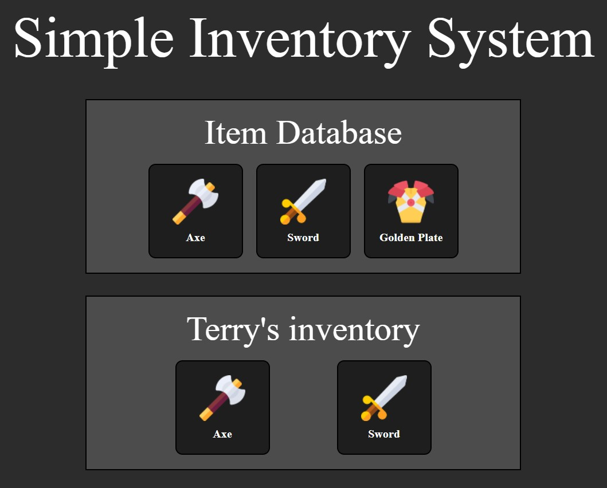

# Basic Inventory system for a game.

This is just a simple inventory system to show off the benefits of objects/arrays in Javascript.

## Adding Items & Players

### Adding an Item to the 'Database'
```
new Item( "Name", "Display Type", weight, damage, armor, stackable?, icon-path, model-path, type )
```

### Adding a Player
```
new Player( "name", "Display Name", health, money, group )
```

### Adding an item to the player's inventory
```
playerVar.inventory.addItem(item[index], quantity);
```

### Preview


Test
